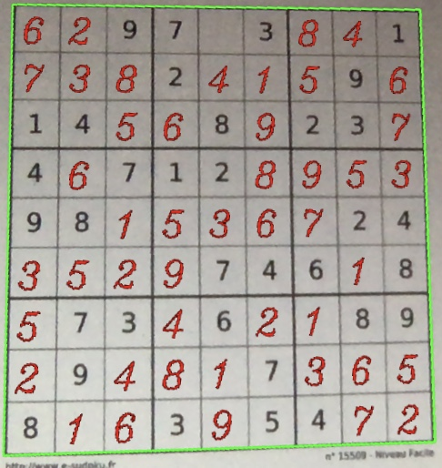

# Intelligent Sudoku Solver AI

This project consists in implementing a real-time Sudoku game solver using the **camera based** on image processing and Deep Learning. Basicly the software detects the grid, then extract the numbers based on a **CNN** model trained with printed characters from the different ubuntu fonts. Then use a Sudoku game resolution script. Finally, The result is displayed on the grid in real time.
During this project, I used :

- Python 3.7.0
- TensorFlow 2.3.1
- Keras 2.4.3
- Opencv-python 4.4.0.44
- Pillow 7.2.0

